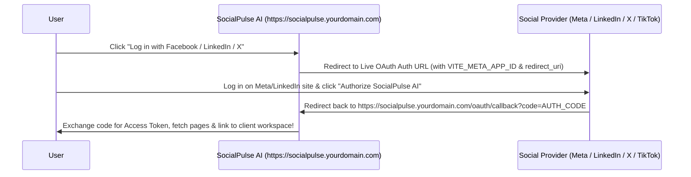

# SocialPulse AI — Production Deployment & Live OAuth Setup Guide

This guide explains how to deploy **SocialPulse AI** to a production live server (Vercel, Netlify, AWS, Cloudflare, or custom VPS) and connect **100% real live social media accounts** via production OAuth 2.0 API apps.

---

## 🏗️ 1. Architecture: Live Server OAuth 2.0 Flow



---

## 🔑 2. How to Register Real Live Social Media Developer Apps

### A. Meta (Facebook & Instagram Graph API)
1. Go to [https://developers.facebook.com/](https://developers.facebook.com/) and click **Create App**.
2. Select **Business / Consumer** app type.
3. Add Products: **Facebook Login**, **Instagram Graph API**, and **Pages API**.
4. In Facebook Login Settings:
   - Add Valid OAuth Redirect URI: `https://socialpulse.yourdomain.com/oauth/callback`
5. Copy your **App ID** and set in `.env`: `VITE_META_APP_ID=your_app_id`

### B. LinkedIn Company Pages & Organization API
1. Go to [https://www.linkedin.com/developers/](https://www.linkedin.com/developers/) and click **Create App**.
2. Associate app with your official LinkedIn Company Page.
3. Under **Auth**:
   - Add Authorized Redirect URL: `https://socialpulse.yourdomain.com/oauth/callback`
   - Select scopes: `w_member_social`, `w_organization_social`, `r_organization_social`.
4. Copy your **Client ID** and set in `.env`: `VITE_LINKEDIN_CLIENT_ID=your_client_id`

### C. Twitter / X Developer v2 API
1. Go to [https://developer.twitter.com/](https://developer.twitter.com/) and create a Developer Project.
2. In User Authentication Settings:
   - Type of App: **Single Page App (SPA)** with PKCE
   - Callback URI: `https://socialpulse.yourdomain.com/oauth/callback`
   - App Scopes: `tweet.read`, `tweet.write`, `users.read`, `offline.access`.
3. Copy **Client ID** and set in `.env`: `VITE_TWITTER_CLIENT_ID=your_client_id`

### D. TikTok for Business API
1. Go to [https://developers.tiktok.com/](https://developers.tiktok.com/) and create a Business App.
2. Set Redirect URI to `https://socialpulse.yourdomain.com/oauth/callback`.
3. Set in `.env`: `VITE_TIKTOK_CLIENT_KEY=your_client_key`

---

## 🚀 3. Live Server Deployment Options

### Option A: Deploy to Vercel (Recommended)
```bash
# Install Vercel CLI
npm install -g vercel

# Deploy project
vercel

# Add Environment Variables in Vercel Dashboard:
# - VITE_OAUTH_REDIRECT_URI=https://your-vercel-app.vercel.app/oauth/callback
# - VITE_META_APP_ID=your_id
# - VITE_LINKEDIN_CLIENT_ID=your_id
```

### Option B: Deploy to Netlify
```bash
# Build production bundle
npm run build

# Deploy dist/ directory
npx netlify-cli deploy --prod --dir=dist
```

### Option C: Docker Container Deployment
```dockerfile
FROM node:20-alpine AS build
WORKDIR /app
COPY package*.json ./
RUN npm install
COPY . .
RUN npm run build

FROM nginx:alpine
COPY --from=build /app/dist /usr/share/nginx/html
EXPOSE 80
CMD ["nginx", "-g", "daemon off;"]
```

---

## ⚙️ 4. Local Testing with Real API Credentials

1. Copy `.env.example` to `.env`:
   ```bash
   cp .env.example .env
   ```
2. Replace dummy values with your real developer Client IDs.
3. Start local server:
   ```bash
   npm run dev
   ```
4. Clicking **`Log in with Facebook`** or **`Launch Live Provider OAuth Page`** will now trigger direct live authorization with your registered Meta/LinkedIn/Twitter developer app!
