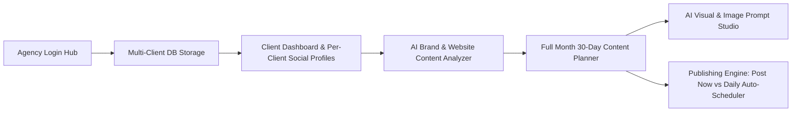

# SocialPulse AI — Open Source Multi-Client Social Media Automation Platform

[](https://opensource.org/licenses/MIT)
[](https://vitejs.dev/)
[](https://react.dev/)
[](https://www.typescriptlang.org/)
[](https://mintlify.com)

**SocialPulse AI** is a production-grade, open-source SaaS platform designed for marketing agencies, social media managers, and brand managers. It enables seamless multi-client workspace management, deep website crawling & brand guide intelligence, 30-day AI social post generation, text-to-image prompt synthesis, and multi-channel publishing with OAuth 2.0 single sign-on integration.

Repository: [https://github.com/pixelfogg/social-media-automation](https://github.com/pixelfogg/social-media-automation)

---

## 🌟 Key Architecture & Flowchart



---

## ✨ Features

### 🏢 1. Multi-Client Agency Hub & Database Storage
- **Isolated Workspace Database**: Manage multiple clients (*Nexus Tech*, *Apex Growth*, *Vanguard Fitness*, *Lumina Skincare*) in persistent storage.
- **Dedicated Client Social Profiles**: Each client has their own distinct social profile array, linked accounts, follower metrics, and posting queues.

### 🔐 2. Per-Client Social Accounts & OAuth 2.0 Single Sign-On
- **3-Step OAuth Authorization**: Login with Facebook/Meta, Instagram, LinkedIn, Twitter/X, TikTok, and Pinterest.
- **Discovered Accounts Picker**: Automatically discover owned pages and pick specific accounts to link to the active client profile.
- **Handshake Verification**: Built-in API latency testing and OAuth access token management.

### 🔍 3. AI Brand & Website Content Analyzer
- **Subpage Indexing**: Crawls website landing pages (`/`, `/services`, `/case-studies`, `/blog`) to extract conversion target CTA links.
- **Strategy Extraction**: Extracts tone of voice, visual direction, target audience personas, and 5 monthly strategic content pillars.

### 📅 4. 30-Day Social Media Content Engine
- **Full Month Calendar**: Synthesizes 30 days of custom social posts with captions, titles, hashtags, platform tags, and client website URLs.
- **Custom Campaign Synthesizer**: Customize target month, focus campaign topic, and tone overrides.
- **Data Exports**: One-click **Export CSV** and **Export JSON** for social scheduling tools.

### 🎨 5. AI Image Prompt & Visual Studio
- **Text-to-Image Prompts**: Generates precise Midjourney v6, DALL-E 3, and Flux 1.1 PRO prompts.
- **Dynamic Graphic Renderer**: Renders visual SVG post cards with customizable brand gradients and typography.
- **Social Feed Mockups**: Live preview in Instagram, Facebook, and LinkedIn feed mockups.

### 🚀 6. Instant Publishing & Daily Push Scheduler
- **Post Immediately**: Trigger instant multi-platform dispatch with live API response logs.
- **Daily 1-Post Push Scheduler**: Automated release queue that pushes 1 post daily at your configured release time.

---

## 🚀 Quickstart & Installation

```bash
# 1. Clone the repository
git clone https://github.com/pixelfogg/social-media-automation.git
cd social-media-automation

# 2. Install dependencies
npm install

# 3. Start development server
npm run dev

# 4. Build production bundle
npm run build
```

---

## 🎨 Design System (Mintlify UI)

SocialPulse AI follows the **Mintlify Design Specification**:
- **Canvas**: `#0a0a0a` (Ultra-dark dark mode canvas)
- **Surfaces**: `#141416` with crisp `#26262a` hairline borders
- **Accent**: `#00d4a4` (Mintlify Mint Green)
- **Typography**: Inter (Prose) + Geist Mono / JetBrains Mono (Code & Prompts)
- **Pill Shapes**: Universal `.btn-mint` and `.btn-pill-dark` rounded pill components (`rounded-full`).

---

## 📄 License

This project is open-source under the [MIT License](LICENSE).
Created and maintained by [Pixelfogg](https://github.com/pixelfogg).
